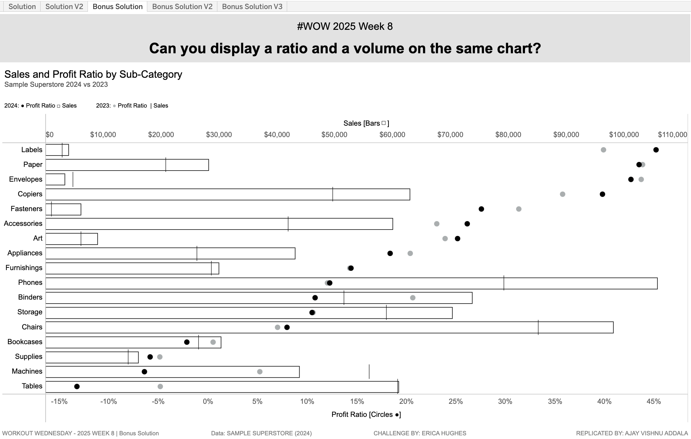

# Workout Wednesday 2025 | Week 8 Challenge

This repository contains solutions for the **Workout Wednesday 2025 | Week 8** challenge. The challenge focuses on creating a **Ratio And Volume Ensemble (RAVE) chart** to display a ratio (Profit Ratio) and a volume (Total Sales) efficiently on a single Tableau sheet. The dataset used is **Sample Superstore (2024 version)**.

---

## Project Overview

### Challenge Requirements:
1. **Profit Ratio as a Dot Plot**:
   - Positioned on the bottom axis.
   - Black filled circles.
   - Labeled with the subtitle "Circles ●" for user guidance.

2. **Total Sales as a Bar Chart**:
   - Positioned on the top axis.
   - Bars with white fill, black borders, and 0% opacity.
   - Labeled with the subtitle "Bars ◻" for user guidance.

3. **Additional Details**:
   - Dot Plot (Profit Ratio) placed in the foreground.
   - Grid lines and zero lines removed.
   - Tooltips include:
     - First line: `[Sub-Category]: [Profit Ratio]` (bold).
     - Second line: `Sales: [Sales Amount]`.

### Bonus Requirements:
- Include **2023 data**:
  - Add a second grey dot for 2023 Profit Ratio.
  - Add a reference line for 2023 Total Sales.
  - Adjust tooltips to show all relevant information.

---

## Dashboards

### 1. **Solution**
   - Implements the core RAVE chart requirements.
   - Displays **Profit Ratio (2024)** and **Total Sales (2024)** by Product Sub-Category.

### 2. **Bonus Solution**
   - Adds time comparison:
     - A second grey dot for **2023 Profit Ratio**.
     - A reference line for **2023 Sales**.
   - Tooltips enhanced to include both years' data.

### 3. **Solution V2**
   - Color-codes Profit Ratio dots based on their sign:
     - **> 0**: Positive Profit Ratio.
     - **< 0**: Negative Profit Ratio.

### 4. **Bonus Solution V2**
   - Focuses on **Profit Ratio change from 2023 to 2024**.
   - Use case: Analyze efficiency improvements or declines between years.

### 5. **Bonus Solution V3**
   - Focuses on **Sales change from 2023 to 2024**.
   - Use case: Highlight areas of significant sales growth or decline year-over-year.

---

## Key Features

- **Space-Efficient Visualization**: Combines ratio and volume in one chart to save space while maintaining clarity.
- **Visual Hierarchy**: Ensures Profit Ratio is the primary focus, with Sales providing context.
- **Year-over-Year Insights**: Enables deeper analysis with added time comparisons.
- **Dynamic Coloring**: Enhances interpretability with Profit Ratio sign-based colors.

---

## Snapshot

---
